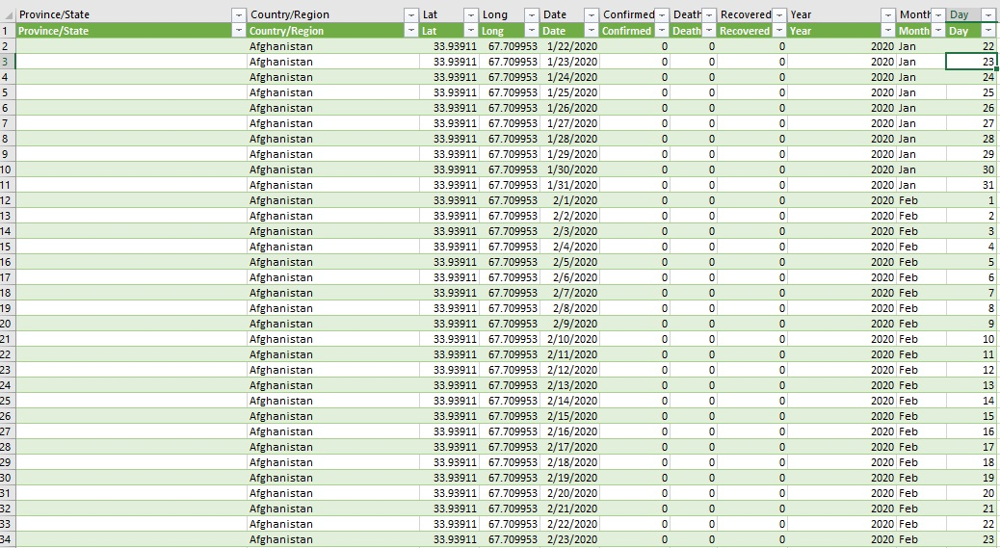
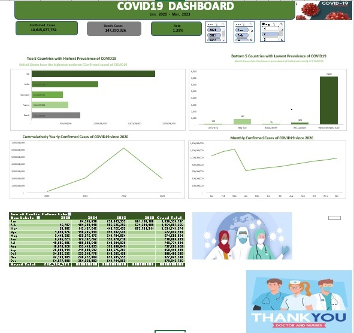

## ANALYSIS OF COVID-19 PANDEMIC

## TABLE OF CONTENTS
- Introduction
- Problem Statement
- Data Collection/Sourcing
- Data Cleaning and Preparation
- Insights
- Recommendations

## Introduction
The Covid-19 pandemic is a global health crisis caused by the severe acute respiratory syndrome coronavirus 2 (SARS-CoV-2). It was first identified in December 2019 in the city of Wuhan, Hubei province, China. The virus basically spreads through respiratory droplets when an infected person coughs, sneezes, talks, or breathes. It can also be spread by touching surfaces contaminated with the virus and then touching the face, although this is considered a less common mode of transmission.

The pandemic has had significant global impacts on public health, nations economy, education, travel, and daily life. Measures have been implemented by both Governments and health organizations worldwide to contain the spread of the virus, including widespread testing, contact tracing, social distancing, mask mandates, travel restrictions, and vaccination campaigns.

## PROBLEM STATEMENT
This project aims at analyzing the global impact of the Covid-19 pandemic, spread, impact, and response to the virus, in order to inform evidence-based decision-making, develop targeted interventions, and mitigate the health, social, and economic consequences of the pandemic.

## DATA COLLECTION/SOURCING
I collected the Dataset from COVID-19 Data repository by the Centre for Systems Science and Engineering (CSSE) by John Hopkins University. The data contains daily time series summary tables, including confirmed, deaths and recovered which is updated every 24 hours from the official source. The raw file can be accessed 

[https://github.com/CSSEGISandData/COVID-19/tree/master/csse_covid_19_data/csse_covid_19_time_series].

## DATA CLEANING AND EXPLORATION
The datasets are made up of three different tables; The Confirmed cases, Death cases and Recovered cases which contains different columns and values. The data cleaning and preparation was done using Microsoft Excel Power Query Editor. I ensured the quality of the dataset by removing unneccessary and empty columns, checked for correct data types.

The three datasets were merged together to get a consolidated datasets which was used for analysis and visualization. I created the year, month and day values from the date columns using the Year, Month and Day Funtions respectively. I also got the daily confirmed, death and recovered cases. After the data cleaning process, I loaded the dataset to the excel worksheet. I created new worksheet for data visualization and Analysis. Below is a preview of the cleaned consolidated dataset used for the analysis.

## Covid-19 Consolidated Data

## Covid-19 Analysis Dashboard

## INSIGHTS
- United States, India, Brazil, France and Germany have the highest prevalence of the COVID-19 Pandemic.
- North Korea, Antartica, Ms. Zaandam and Winter Olympics are the least affected countries.
- The global total confirmed cases is 10,615,077,761
- A total of 147,290,926 deaths were recorded.
- The death rate was 1.39%
- The year 2022 has the highest number of confirmed cases followed by 2021 while 2020 remains the least year.
- There was increase in COVID-19 which was drastically reduced after 2022.

## RECOMMENDATIONS
- Continous public health messaging to promote preventive measures such as Social distancing, hand hygiene, mask wearing and uphold coughing etiquette.
- Learn from the COVID 19 experience and invest more in pandemic preparedness for future outbreaks.
- Provide support systems and interventions to address the psychological well-being of individuals after the crisis.
- Vaccination campaigns should be prioritized especially to vulnerable populations.
